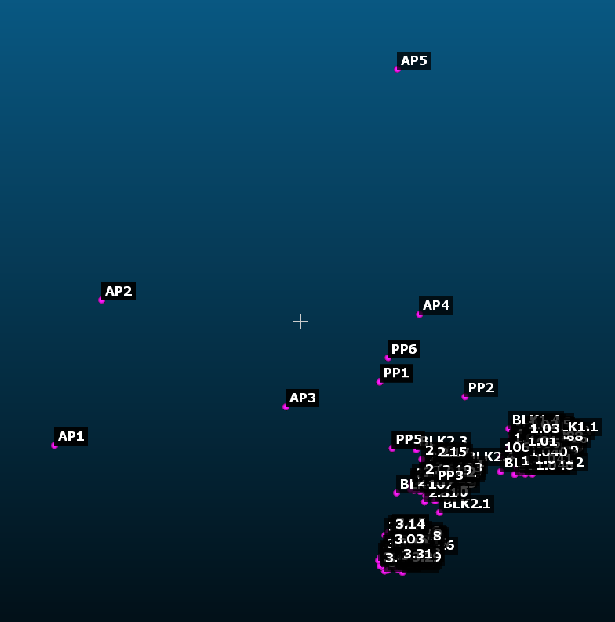
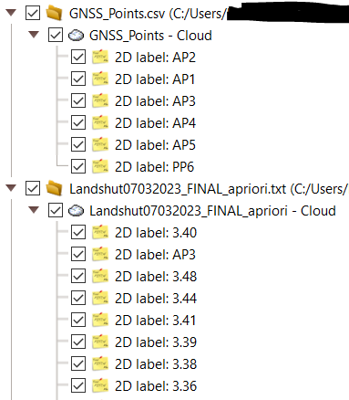

# CloudCompare Label Extractor
This tool was created out of a necessity to export label locations out of CloudCompare (c.f. [this forum post](https://danielgm.net/cc/forum/viewtopic.php?t=4484)).

Suppose you have a point cloud where each point has a label, like so:

You do your manipulations in CloudCompare and wish to export the finished point cloud when you realize that CloudCompare allows you to export everything but the point labels.
And like in my case, the labels might be crucial for further processing.
Since the labels may contain alphanumeric characters, you cannot simply convert them to a scalar field as well.
Hence, the necessity for this small tool was born.

Since CloudCompare does store the label info in its own binary format, I figured that I could simply parse those binary files and extract the label information from that.
Because this project is more or less a small helper script, and I am only open sourcing it for others who find themselves in the same situation, it is not very polished.

# Usage
## Prerequisites
- IntelliJ
- JDK 19 or later
- CloudCompare version 2.12.4 (later versions might work but are untested)

## Preparation in CloudCompare
Because I didn't bother implementing a parser for all CloudCompare entities (writing the parser as it is already took me the better part of a week), it only supports parsing folders, point clouds and labels.
Your CloudCompare data must therefore have the following structure:

- Multiple top-level folders
  - Only one point cloud per folder
    - Multiple Labels per point cloud

Including any other data in the file will lead to exceptions when parsing it with the script.
In particular, including additional metadata or entities created by plugins will cause exceptions as I was unable to figure out how CLoudCompare encodes them in the bin-files.

Once you organized your data hit Ctrl+A to select the entire DB tree, click on the Save-Icon and save the data as "CloudCompare entities (*.bin)"

## Extraction using this script
- Clone the project from GitHub (using the big green button on the top right) or download the ZIP and unzip it somewhere
- Open the project in IntelliJ
- Open the file "Main.kt" (you will find it under src/main/kotlin/com/github/vatbub/cloudcompare)
- Enter the location of the CLoudCompare bin file you just stored (line `inputFile = File("C:\\Users\\path\\to\\CloudCompare-file.bin"),`)
- Enter the location where you want the exported label data to be stored (line `outputFolder = File("C:\\Users\\path\\to\\cloudCompareOutput"),`)
- Press the green arrow on the left of the line `fun main() {` to run the script.
- IntelliJ will now compile and run the script. The progress as well as any error messages will be shown in the tool window that opens automatically.

# Maintenance on this project and contributing
I will probably not maintain this tool anymore except if I have to use it myself again. 
Therefore, if you need some changes, feel free to fork this project and submit a PR, but don't expect me to help you much.
Also, beware that you are opening pandora's box.
The source code of CloudCompare and by extension the source code of this tool is a giant mess.
You also might want to read the learnings I wrote down below before proceeding.

# License
This tool is licensed under the Apache License v2. To see the license, go to [http://www.apache.org/licenses/LICENSE-2.0](http://www.apache.org/licenses/LICENSE-2.0).

# Learnings while writing this tool
This section documents the hurdles that I had to overcome while writing this tool:

- The binary-file decoding logic starts in [`BinFilter.cpp`](https://github.com/CloudCompare/CloudCompare/blob/master/libs/qCC_io/src/BinFilter.cpp).
- Most of the decoding logic can be found in [`ccHObject::fromFile`](https://github.com/CloudCompare/CloudCompare/blob/a14f0433a137c09e63c3e833c5041bc8632824f7/libs/qCC_db/src/ccHObject.cpp#L1025)
- The documentation that CLoudCompare has on the Bin-format is outdated. Unfortunately, you need to read the source code to understand how it actually works.
- CloudCompare binary files are always little-endian except for the parts that are written using a `QDataStream` which is always big endian.
- `QDataStream` does not encode any header information (only caveat is that it's big-endian)
- `QDataStream` encodes strings by first encoding the length of the string in bytes including the null-byte as a big-endian `UInt` (for `null` strings, the length is encoded as `0xFFFFFFFF`) followed by the string itself encoded in UTF-16 including the null-byte
- The source code of CloudCompare is a giant mess of spaghetti. Accept that CloudCompare is a great tool but avoid to look under its hood.
